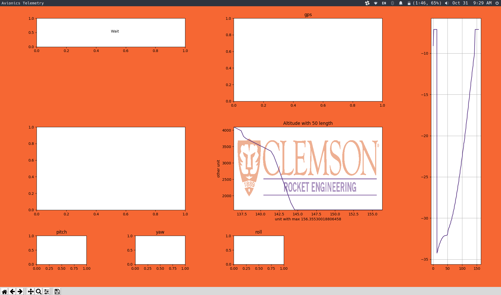

# Base Telemetry
### TODO
* ~~Decide between keeping in python2 or converting to python3~~
  * Old in python2, new in python3 (they run independently)
* Decide what needs to be represented on base station
  * Graphs
    * GPS
    * Accleration
  * Animations
    * Pitch
    * Yaw
    * Roll
    * Velocity (speedometer)
    * Altitude (single bar)
  * Numbers
    * All else

### Running
#### Compiling and Running
1. `python2 main.py` for main telemetry
2. `python3 mpl.py` for visual data
   * Requires `main.py` to be running
   
#### Debugging
* To debug and test `mpl.py`
  1. Run `python3 mpl_simulator.py`
  2. Also run `python3 mpl.py` while the other is running
  3. Look at graphs and adjust program
  4. Remove `quickbox.json` when complete, or don't, just don't push it
* To debug and test `main.py`
  1. Pray to the gods that it works

### Information
* JSON Formatting
  * example: `{"sensors":{"gyro":{"x":0,"y":0,"z":0},"acc":{"x":0.000025,"y":0.000025,"z":38.01759},"mag":{"x":0,"y":0,"z":0},"att":{"r":6.451225e-7,"p":-6.451225e-7,"y":-0.108385},"bar":{"p":101324.9,"dp":0.890625,"alt":0.001904,"gnd":1237.593,"temp":0,"hum":0},"gps":{"lat":0,"lon":0,"hour":0,"min":0,"sec":0,"day":0,"mon":0,"year":0}},"type":"telemetry","time":804}`
  * Rocket will return self-contained json
    * Will always contain `type`, `time`, and `state`
      * `type` will be 1 of: state, telemetry, 
      * `state` will be 1 of the states: ignite, 
    * Telemetry contains ... TODO

### Components
#### Current Components
* Communications Antenna
  * ???
